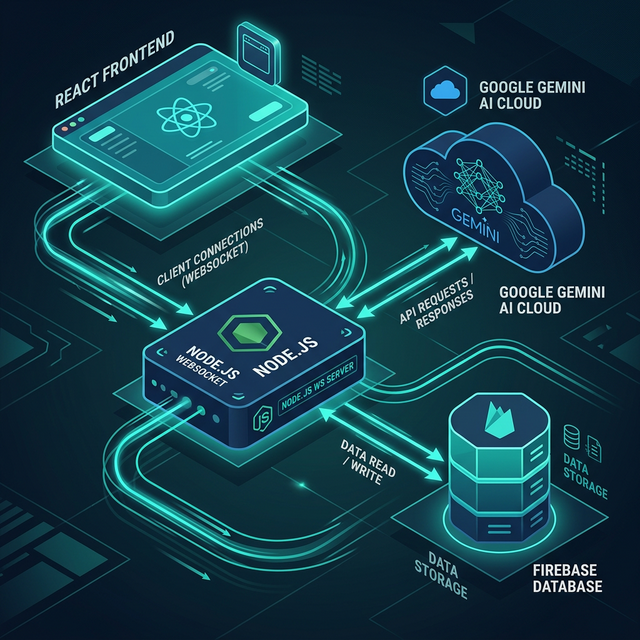
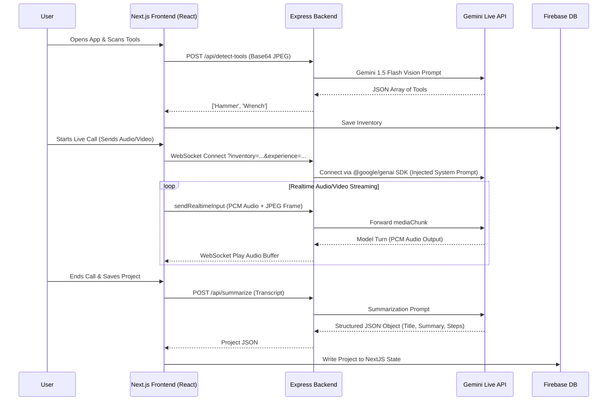

# HandyMate 🛠️
*The AI-Powered Contractor for DIY Success*

**Developed for the Google Gemini Live Agent Challenge 2026**
**© 2026 Lonrú Consulting Ltd. | Active Architecture™ Powered by Lonrú Studios™**

---

## Inspiration
DIY projects can be incredibly rewarding, but they often start (and end) with frustration. When you're mid-repair and realize you're doing something wrong, YouTube tutorials can only help so much—they can't look at your specific leaky pipe and tell you exactly what you've missed. Hardware store runs are frequent because of poor planning, and calling out a contractor for a 15-minute fix is prohibitively expensive. 

## What it does
**HandyMate** is a real-time, multimodal AI contractor that lives in your browser. Powered by the **Gemini 2.5 Flash Native Audio** model and **Google's Realtime Live API**, HandyMate doesn't just talk to you—it *sees* what you're doing.

You simply open the web app, set your phone up, and show HandyMate the problem. The agent instantly diagnoses the issue, asks clarifying questions in a natural, conversational tone, and guides you step-by-step through the repair.

### Key Features
1. **Real-Time Multimodal Vision & Audio:** HandyMate streams a live 1 FPS video feed of your camera straight to Gemini while holding a low-latency WebRTC audio conversation with you. If you pick up the wrong wire or use the wrong tool, HandyMate will literally interrupt you to keep you safe.
2. **Vision-Powered Tool Inventory:** Instead of typing out what tools you own, simply point your camera at your toolbox. HandyMate uses Gemini 1.5 Flash Vision to instantly scan and catalog your available equipment.
3. **Adaptive Context & Experience Leveling:** If you're a beginner, HandyMate explains things simply. If you're an expert, it skips the basics. If it suggests a fix but you don't have the right wrench in your inventory, it will advise you on exactly what you need to buy.
4. **Resumable Repair Calls:** Need to run to the hardware store? End the call. HandyMate automatically generates a structured step-by-step summary of the job and saves it to Firestore. When you return, click "Resume," and HandyMate will greet you with full knowledge of exactly where you left off.

---

## 🏗️ System Architecture

HandyMate uses a robust decouple architecture balancing the React frontend with a secure Express backend payload wrapper.

---

## 🚀 How we built it
- **Frontend:** Next.js 14 (App Router), React Hooks, Tailwind CSS (Teal Glassmorphism theme), HTML5 `<canvas>` API for frame extraction, Web Audio API for PCM encoding.
- **Backend:** Node.js, Express, `ws` (WebSockets).
- **AI Models:** `@google/genai` (Official SDK), `gemini-2.5-flash-native-audio-latest` for realtime streaming, `gemini-1.5-flash` for static vision parsing.
- **Database:** Firebase Authentication & Firestore (NoSQL).

### Challenges we ran into
The most significant hurdle was mapping the browser's local MediaStream into Google's strict `{ realtimeInput: { mediaChunks } }` format via an intermediary Node.js server. We initially achieved duplex audio, but the AI couldn't "see" the problem. We solved this by architecting a hidden Javascript loop in our custom `useLiveAPI` hook that draws the `<video>` stream onto a hidden `<canvas>`, compresses it to a JPEG, and fires a Base64 frame across the WebSocket every 1000ms alongside the audio buffer. 

## Accomplishments that we're proud of
We are incredibly proud of achieving true *multimodality* in a web browser without natively compiled apps. The fact that HandyMate can interrupt its own synthesized speech the millisecond you point your camera at a new tool or ask a clarifying question feels like magic. We are also proud of the dynamic Context Injection—saving a user's tool inventory to Firestore and seamlessly feeding it back into the Gemini Live API prompt during a completely separate session created a profoundly "stateful" feeling that regular LLMs lack.

## What we learned
We learned the intricacies of the WebAudio API and WebSocket buffering, particularly handling the subtle differences in how iOS Safari and Chrome manage AudioContext lifecycles. We also learned how incredibly fast the new Gemini 2.5 Flash Native Audio model truly is when properly fed PCM data instead of standard JSON REST payloads.

## What's next for HandyMate: The Just-In-Time AI-Powered DIY Contractor
- Native iOS and Android application wrapper.
- Integration with local hardware store inventory APIs (e.g. Home Depot) to automatically build shopping carts when users lack the tools required for a diagnosis.
- AR overlays projecting arrows directly onto the user's video feed.
- **Cross-device Google Authentication** utilizing Firebase Auth to allow users to securely log in and sync their DIY inventory and past project history across laptops, tablets, and mobile devices.

---

## 💻 Local Spin-up Instructions
To run this project locally for judging or development:

1. **Clone the repository:**
   `git clone https://github.com/caoimhe-codes/handymate.git`
   `cd handymate`

2. **Start the Express WebSocket Backend:**
   Create a `.env` file in the `/backend` directory containing `GEMINI_API_KEY=your_key_here`.
   `cd backend`
   `npm install`
   `node server.js`
   *(Runs on port 8080)*

3. **Start the Next.js Frontend:**
   Create a `.env.local` file in `/frontend` containing your Firebase config keys.
   `cd frontend`
   `npm install`
   `npm run dev`
   *(Runs on port 3000)*

## ☁️ Proof of Deployment (Google Cloud)
HandyMate fulfills the competition requirement of utilizing Google Cloud Architecture. 
The entire production Next.js frontend routes its WebSocket `<canvas>` frame extraction and WebAudio PCM buffers directly through the Node.js payload wrapper, which is containerized via Docker and actively deployed via **Google Cloud Run** (`https://handymate...run.app`). The database state is managed securely via **Google Firebase/Firestore**.
